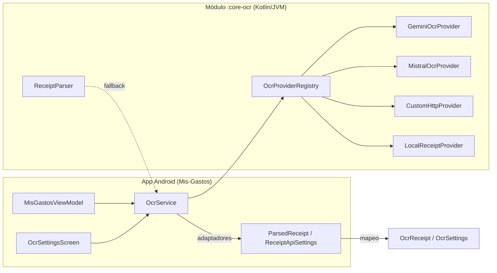

# Informe de sesión: Integración de Mis-Gastos-OCR en la app Mis-Gastos

**Fecha:** 6 de octubre de 2026 · **Repositorio:** `CHUS-creator/Mis-Gastos` · **Biblioteca:** `CHUS-creator/Mis-Gastos-OCR`

---

## 1. Objetivo

Integrar la biblioteca Kotlin/JVM **Mis-Gastos-OCR** (OCR de tickets con proveedores conectables, ya publicada y probada con 13/13 tests OK) dentro de la app Android **Mis-Gastos**, sustituyendo el código OCR duplicado de la app por un módulo `core-ocr` reutilizable.

## 2. Cambios realizados en el proyecto

### Módulo nuevo: `core-ocr/` (48 archivos)
- Copia completa de la biblioteca: `api/`, `providers/`, `parser/`, `json/`, `http/` bajo `com.misgastos.ocr`.
- Tests del módulo (`src/test/kotlin`) + corpus de **33 tickets de prueba** con manifiesto (`src/test/resources/receipts`).
- `core-ocr/build.gradle.kts` nuevo: plugin Kotlin/JVM, toolchain 17, `kotlinx-coroutines-core`, JUnit, `workingDir = projectDir` en Test.

### Configuración del build
- `settings.gradle.kts`: añadido `include(":core-ocr")`.
- `gradle/libs.versions.toml`: añadidos `kotlinx-coroutines-core` y el plugin `kotlin-jvm`.
- `build.gradle.kts` (raíz): registrado `kotlin-jvm` con `apply false`.
- `app/build.gradle.kts`: añadida la dependencia `implementation(project(":core-ocr"))`.

### Refactor de la app (`app/`)
- **`ocr/ParsedReceipt.kt`**: reescrito; mantiene los modelos de la app y añade adaptadores hacia la biblioteca (`toParsedReceipt`, `toAppLineItem`, typealias `ReceiptTemplate`).
- **`ocr/ReceiptApiSettings.kt`**: reescrito; guarda proveedor + configuración genérica (JSON) con migración de la clave legacy `api_key`; sigue usando `EncryptedSharedPreferences`.
- **`ocr/OcrService.kt`** (nuevo): orquestador con registry bundleado, listado de proveedores y `extract(...)` con fallback al parser local.
- **`MisGastosViewModel.kt`**: `extractReceipt` delega ahora en `OcrService.extract(...)`; el benchmark usa el parser de la biblioteca.
- **`OcrSettingsScreen.kt`**: reescrita como UI **genérica** — chips y campos generados desde `configSchema` de cada proveedor (secrets ocultos, placeholders, opcionales). Añadir proveedores nuevos ya no requiere tocar pantallas.
- **`strings.xml`** (es/en): textos de proveedor generalizados.
- **Eliminado** el código OCR antiguo: `ReceiptApiClient.kt`, `ReceiptParser.kt`, `ReceiptTemplate.kt` y sus tests/recursos (trasladados a la biblioteca).

## 3. Verificación

| Prueba | Resultado |
|---|---|
| `gradle :core-ocr:test` (build integrado de Mis-Gastos) | ✅ BUILD SUCCESSFUL |
| Tests del módulo (Registry, Corpus, JsonParser) | ✅ 13/13 OK, 0 fallos |
| Compilación de `:app` | ⚠️ No verificada — el entorno no tiene Android SDK (probar en Android Studio) |

**Incidencias resueltas durante la verificación:**
- AGP 8.13.2 requiere Gradle ≥ 8.13 → se descargó y usó Gradle 8.13 portátil.
- El daemon de Gradle moría por límite de memoria → ejecutado con `-Xmx384m -XX:MaxMetaspaceSize=200m -XX:+UseSerialGC`, `--no-daemon --max-workers=1`.

## 4. Publicación en GitHub

- Rama **`feature/core-ocr`** creada sobre `main`.
- **3 commits** con 59 archivos:
  1. `feat(core-ocr): añade módulo core-ocr y lo conecta al build` (19 archivos)
  2. `test(core-ocr): añade corpus de tickets de prueba` (33 archivos)
  3. `refactor(app): usa OcrService del módulo core-ocr; UI genérica y strings` (7 archivos)
- **39 archivos obsoletos eliminados** (antiguo OCR de la app y sus tests/recursos).
- **Pull Request #12 abierto:** https://github.com/CHUS-creator/Mis-Gastos/pull/12

## 5. Arquitectura resultante

## 6. Próximos pasos

1. **Compilar `app` en Android Studio** y revisar la pantalla de ajustes de OCR (chips de proveedores y campos dinámicos).
2. Revisar y fusionar el [PR #12](https://github.com/CHUS-creator/Mis-Gastos/pull/12).
3. Limpieza opcional: eliminar los strings obsoletos sin usar (`settings_ocr_provider_local`, `settings_ocr_api_key`, hints gemini/mistral).
4. Pendiente opcional anterior: subir el Gradle wrapper al repo **Mis-Gastos-OCR**.

## 7. Beneficio clave

Añadir un proveedor OCR nuevo ya **no requiere tocar ninguna pantalla ni el ViewModel**: basta con implementar `OcrProvider` y registrarlo — la UI y el servicio lo detectan automáticamente.